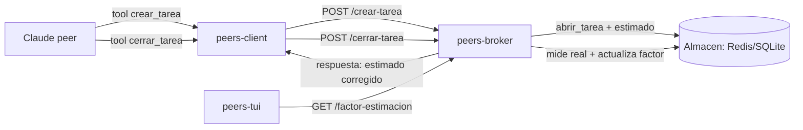

# TDD — Tareas autogestionadas + aprendizaje de estimación (arquitectura técnica)

| Campo | Valor |
|-------|-------|
| Tech Lead | Claudio (arquitecto) / Max (dueño) |
| Equipo | claude-peers-rs (peers-core, peers-broker, peers-client, peers-tui) |
| Decisión base | [ADR-002](../adr/002-factor-correccion-aprendizaje-estimacion.md) · Spec: `.specs/features/tareas-autogestionadas-aprendizaje/spec.md` |
| Tamaño | Medium (~8 tareas) |
| Estado | Draft |
| Fecha | 2026-06-29 |

## Contexto

claude-peers-rs ya mide el tiempo **real** de las tareas (el broker timbra inicio/fin con su
reloj — regla sagrada de la VISIÓN). Falta capturar el **estimado** de la IA y aprender de la
diferencia para corregir estimaciones futuras. La decisión (ADR-002) es un **factor de
corrección global** por media móvil. Este TDD documenta la arquitectura técnica concreta:
qué cambia en cada crate (Rust) y cómo se ve en la TUI.

## Problema

La IA estima "1 semana" cuando Max tarda 1 hora. Hay que cerrar el bucle: la IA crea su tarea
con un estimado (vía tool MCP nativa) → el broker mide el real → aprende el factor → al crear
la siguiente tarea, devuelve el estimado ya corregido.

## Alcance

**In scope (V1):** campo `estimado_seg` en `Tarea`; `FactorEstimacion` persistido + aprendizaje
por media móvil con clamp; 5 tools MCP de tarea en el peers-client; endpoints `/crear-tarea`,
`/cerrar-tarea`, `/listar-tareas`, `/factor-estimacion`; el factor visible en la pantalla Broker
de la TUI. **Out of scope:** factor por tipo de tarea, estados de tarea (asignada/bloqueada),
reasignación, pantalla Equipo completa (→ Fase 4/5 del consejo-roadmap).

## Solución técnica

### Arquitectura (componentes y flujo)



### Cambios por crate (Rust)

**`peers-core/src/lib.rs`:**
- `struct Tarea`: añadir `estimado_seg: Option<i64>` con `#[serde(default, skip_serializing_if = "Option::is_none")]` (compat con tareas viejas).
- Nuevo `struct FactorEstimacion { muestras: u32, factor: f64, actualizado_en: String }`.
- `struct PeticionAbrirTarea`: añadir `estimado_seg: Option<i64>`.
- `struct RespuestaAbrirTarea`: añadir `estimado_corregido_seg: Option<i64>`, `factor: f64`, `muestras: u32`.
- Constantes: `FACTOR_ALPHA: f64 = 0.3`, `FACTOR_MIN: f64 = 0.5`, `FACTOR_MAX: f64 = 50.0`.

**`peers-core/src/almacen.rs` (trait `Almacen`):**
- `async fn factor_estimacion(&self) -> Result<FactorEstimacion>` (lee; default factor=1.0, muestras=0 si no existe).
- `async fn actualizar_factor(&self, ratio: f64, ahora: &str) -> Result<FactorEstimacion>`.
- (Reusa `tarea_guardar`/`tarea_obtener`/`jornada` ya existentes para abrir/cerrar.)

**`peers-broker/src/store.rs` + `db.rs`:** implementar los 2 métodos nuevos.
- Redis: `FactorEstimacion` en HASH `cprs:factor_estimacion`. `actualizar_factor` aplica la
  media móvil: `nuevo = factor_actual + ALPHA * (ratio - factor_actual)`, clamp a [MIN, MAX],
  `muestras += 1`. SQLite: tabla `factor_estimacion(id=1, muestras, factor, actualizado_en)` con UPSERT.

**`peers-broker/src/main.rs` (handlers, bajo token):**
- `POST /crear-tarea`: reusa `jornada::abrir_tarea`, guarda `estimado_seg`; calcula el corregido
  (`estimado/factor`) leyendo el factor; responde `RespuestaAbrirTarea` con corregido+factor+muestras.
- `POST /cerrar-tarea`: cierra (mide real). Si la tarea tenía `estimado_seg` y `real>0`:
  `ratio = estimado_seg / real_seg`; llama `actualizar_factor(ratio)`.
- `POST /listar-tareas {instancia_id}` → `Vec<Tarea>` vía `jornada`.
- `GET /factor-estimacion` → `FactorEstimacion`.

**`peers-client/src/mcp.rs` (tools — `definiciones_tools`):** añadir 5 tools en español:
`crear_tarea(descripcion, estimado_seg)`, `reportar_tarea(texto)`, `cerrar_tarea()`,
`listar_tareas()`, `revisar_tareas()`. La función `instrucciones(id)` gana una línea guía
(R7 del spec): "Antes de trabajo sustancial, crea una tarea con tu estimado; al terminar,
ciérrala — el broker mide tu tiempo real y aprende a corregir estimaciones."

**`peers-client/src/main.rs` (`ejecutar_tool`):** despachar las 5 tools nuevas a métodos del
`ClienteBroker`; `crear_tarea` devuelve al agente el texto con el estimado corregido
("dijiste 5d; según tu historial ~6h, factor 6.2x de 23 muestras").

**`peers-client/src/broker.rs`:** métodos `crear_tarea`, `cerrar_tarea`, `listar_tareas`
(POST con token, como el resto).

**`peers-tui/src/ui/broker.rs`:** mostrar `factor` + `muestras` (vía `GET /factor-estimacion`,
nuevo método en `cliente.rs`). Pantalla Equipo completa → fase futura.

### Contrato de API (ejemplos)

```
POST /crear-tarea  { "instancia_id":"claudio", "descripcion":"feature X", "estimado_seg":432000 }
→ 200 { "tarea_id":"tar-...", "estimado_corregido_seg":3600, "factor":6.2, "muestras":23 }

POST /cerrar-tarea { "tarea_id":"tar-..." }
→ 200 { "ok":true }   (efecto: mide real, si había estimado actualiza el factor)

GET  /factor-estimacion
→ 200 { "muestras":24, "factor":6.4, "actualizado_en":"2026-06-29T..." }
```

## Fórmula del aprendizaje (el núcleo)

```
ratio_tarea   = estimado_seg / real_seg          (cuánto infló la IA en ESTA tarea)
factor_nuevo  = factor + ALPHA * (ratio - factor)   (media móvil exponencial, ALPHA=0.3)
factor_nuevo  = clamp(factor_nuevo, 0.5, 50.0)      (un outlier no lo enloquece)
estimado_corregido = estimado_ingenuo / factor       (lo que se devuelve a la IA)
```

## Riesgos

| Riesgo | Impacto | Prob. | Mitigación |
|--------|---------|-------|------------|
| La IA no crea tareas → no aprende | Medio | Media | Instrucción en el harness (R7) que la guía; degrada sin bloquear |
| Outlier extremo distorsiona el factor | Medio | Media | Clamp [0.5, 50] + media móvil (no promedio crudo) |
| Factor global no distingue tipos de tarea | Bajo | Alta | Aceptado en V1; evolución a factor-por-tipo si la varianza molesta (ADR-002) |
| Romper deser. de tareas viejas | Alto | Baja | `#[serde(default)]` en `estimado_seg`; test de compat |

## Estrategia de pruebas

- **Unit (peers-core):** la fórmula de `actualizar_factor` (media móvil + clamp): ratio 120 con
  factor 1 → clampa a 50; secuencia de ratios converge; deser. de `Tarea` vieja sin `estimado_seg`.
- **Integración (Redis + SQLite):** abrir tarea con estimado → cerrar → el factor se actualiza;
  `factor_estimacion` persiste y se lee igual en ambos backends.
- **E2E (peers-client):** las 5 tools aparecen en `tools/list` en español; `crear_tarea`
  devuelve el corregido.

## Plan de implementación (fases)

| Fase | Tareas | Crate |
|------|--------|-------|
| 1 | Tipos + fórmula + tests | peers-core |
| 2 | `factor_estimacion`/`actualizar_factor` (Redis+SQLite) | broker store/db |
| 3 | Handlers `/crear-tarea`,`/cerrar-tarea`,`/listar-tareas`,`/factor-estimacion` | broker main |
| 4 | 5 tools MCP + instrucción harness + despacho | peers-client |
| 5 | Factor visible en pantalla Broker | peers-tui |
| 6 | Verificación + build (Redis y sqlite) + revisión adversarial | — |

> Implementar DESPUÉS de la Fase 1+2 de entrega durable (tocan los mismos crates). Reusa la
> jornada/fichaje de tareas ya existente — no reinventa.

## Rollback

Feature aditiva y degradante: si algo falla, las tools de tarea simplemente no se usan y el
broker opera igual (la mensajería y la jornada base no dependen del factor). Rollback = revertir
el commit + recargar el LaunchAgent del broker con el binario anterior.
